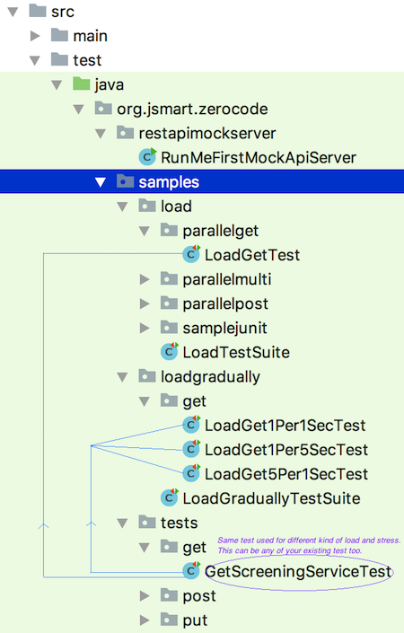

# Performance testing (Testing load and stress)
Sample Performance Tests - Banking



Single scenario parallel load
===
See this `GET` load test in the repo e.g.
```java
@LoadWith("load_generation.properties")
@TestMapping(testClass = GetScreeningServiceTest.class, testMethod = "testGetScreeningLocalAndGlobal")
@RunWith(ZeroCodeLoadRunner.class)
public class LoadGetTest {

}
```
Where, the `load_generation.properties` has the below load e.g.
```properties
number.of.threads=3
ramp.up.period.in.seconds=3
loop.count=1
```

It generates load for the below GET scenario:
```
@TargetEnv("screening_service_host.properties")
@RunWith(ZeroCodeUnitRunner.class)
public class GetScreeningServiceTest {

    @Test
    @JsonTestCase("load_tests/get/get_screening_details_by_custid.json")
    public void testGetScreeningLocalAndGlobal() throws Exception {

    }

}
```

Where the `get_screening_details_by_custid.json` with payload and assertions :
```
{
    "scenarioName": "Screening API- Get Screening by customerId test",
    "steps": [
        {
            "name": "get_screening_details",
            "url": "/api/v1/screening/cust-ids/SINGAHV3033",
            "operation": "GET",
            "request": {
            },
            "assertions": {
                "status": 200,
                "body": {
                    "id" : "SINGAHV3033",
                    "localScreeningStatus" : "Green",
                    "globalScreeningStatus" : "Red"
                }
            }
        }

    ]
}
```
+ [Download](https://github.com/authorjapps/performance-tests/archive/master.zip) or [browse](https://github.com/authorjapps/performance-tests) in the repo

Combining single loads(GET, POST, PUT etc)
===
See the suite test firing different loads with single scenario each 
e.g.
sample test-class: `org.jsmart.zerocode.samples.load.LoadTestSuite`

```java
@Suite.SuiteClasses({

        LoadGetTest.class,
        LoadPostTest.class,
        LoadMultipleGetPostPutTest.class

})
@RunWith(Suite.class)
public class LoadTestSuite {

}
```
+ [Download](https://github.com/authorjapps/performance-tests/archive/master.zip) or [browse](https://github.com/authorjapps/performance-tests) in the repo

Multi scenario parallel load
===
See the test-class `org.jsmart.zerocode.samples.load.parallelmulti.LoadMultipleGetPostPutTest`
```java
/**
 * What's new in ZeroCodeMultiLoadRunner.class ?
 * ---------------------------------------------
 * While running with "ZeroCodeMultiLoadRunner.class", each test mapping here is equivalent to one user,
 * that means there are 3 concurrent users below invoking their respective user operations as:
 *         User-1) POST,GET
 *         User-2) PUT,GET
 *         User-3) GET
 *         User-N) so on
 *
 * Note :
 * ------
 * All 3 users are running in parallel which resembles the production like scenario where each user
 * doing different jobs.
 *
 * You can keep feeding/adding as many tests by using @TestMapping(TestClassName.class, "testMethodName")
 *
 * Please make sure you set "number.of.threads" >= "number of test mappings(= 3 here)" giving chance for
 * each scenario to get executed at least once.
 *
 */
@LoadWith("load_generation.properties")
@TestMapping(testClass = GetScreeningServiceTest.class, testMethod = "testGetScreeningLocalAndGlobal")
@TestMapping(testClass = PostCorpLoanServiceTest.class, testMethod = "testPostNewLoan_crudOperations")
@TestMapping(testClass = PutCorpLoanServiceTest.class, testMethod = "testPutAmendExistingLoan")
@RunWith(ZeroCodeMultiLoadRunner.class)
public class LoadMultipleGetPostPutTest {

}
```
+ [Download](https://github.com/authorjapps/performance-tests/archive/master.zip) or [browse](https://github.com/authorjapps/performance-tests) in the repo

#### (Optionally)Grouping the multiload tests
You can(optionally) group the `@TestMapping`s as below for better readability and pretty looking too.
```java
@LoadWith("load_generation.properties")
@TestMappings({
        @TestMapping(testClass = GetScreeningServiceTest.class, testMethod = "testGetScreeningLocalAndGlobal"),
        @TestMapping(testClass = PostCorpLoanServiceTest.class, testMethod = "testPostNewLoan_crudOperations"),
        @TestMapping(testClass = PutCorpLoanServiceTest.class, testMethod = "testPutAmendExistingLoan")
})
@RunWith(ZeroCodeMultiLoadRunner.class)
public class LoadMultipleGroupAnnotationTest {
}
```
+ [Download](https://github.com/authorjapps/performance-tests/archive/master.zip) or [browse](https://github.com/authorjapps/performance-tests) in the repo

Load with gradually increasing or decreasing
===

See the test-class `org.jsmart.zerocode.samples.loadgradually.LoadGraduallyTestSuite`
```java
@Suite.SuiteClasses({

        LoadGet1Per5SecTest.class, // <-- Less load (5 sec gap)
        LoadGet1Per1SecTest.class, // <-- Bit more load (1 sec gap)
        LoadGet5Per1SecTest.class  // <-- Heavy load (0.2 sec gap)

})
@RunWith(Suite.class)
public class LoadGraduallyTestSuite {

}
```
+ [Download](https://github.com/authorjapps/performance-tests/archive/master.zip) this project to run using your local IDE

Maven library used
===
+ Latest release:
```
<dependency>
    <groupId>org.jsmart</groupId>
    <artifactId>zerocode-rest-bdd</artifactId>
    <version>1.2.x</version> 
</dependency>
```
+ Check here for the latest in [Maven Central](https://mvnrepository.com/artifact/org.jsmart/zerocode-rest-bdd)

